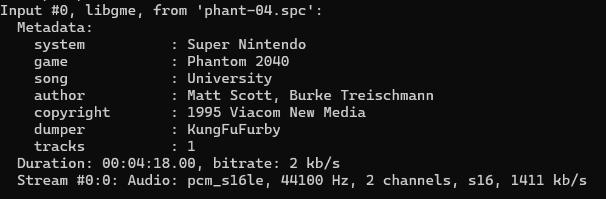

# spc_music_player
play spc music in windows

adobe注册机音乐怪好听，溯源查证后发现出自一款NES老游戏，你可以从这里获取原声带http://snesmusic.org/v2/profile.php?set&selected=1992

使用ffmpeg可以直接播放（真出乎意料，ffmpeg竟然还在维护这种老古董）

但是我想把它直接嵌入我的程序，就需要找更轻量的库来播放

使用模拟器库https://slack.net/~ant/libs/audio.html#snes_spc

不幸的是，官网已经404了。但幸运的是，webarchive存档了此文件

https://web.archive.org/web/20110812132836/http://blargg.parodius.com/libs/snes_spc-0.9.0.zip

其实就是转换为wav格式然后使用winapi播放
